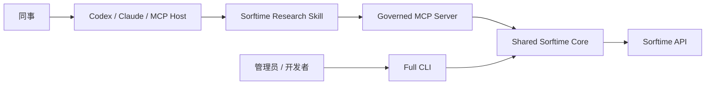

# Sorftime MCP + Skill + CLI

[](https://github.com/ccchenhuohuo/sorftime-mcp/actions/workflows/ci.yml)

面向团队共享的 Sorftime 数据接入项目。它把同一个确定性 API 核心同时提供给受治理的 MCP Server 和完整 CLI，并用 Sorftime Research Skill 指导 AI 选择安全工具、处理澄清、控制成本和解释结果。

- **MCP Server**：同事和 AI 助手的统一入口；Token 集中保管，按身份审计和限流；首版仅开放免费只读能力。
- **Sorftime Research Skill**：负责自然语言路由、证据边界和回答规范，不持有 Token、不执行 HTTP。
- **CLI**：覆盖文档实际列出的全部 52 个接口，用于管理员/开发者批处理、调试、排障和应急操作。



## 当前共享策略

普通用户只看到 4 个任务型工具：

| 工具 | 用途 |
|---|---|
| `sorftime_capabilities` | 发现当前策略、站点和管理员能力 |
| `sorftime_list_monitors` | 列出既有关键词、榜单和 ASIN 订阅监控 |
| `sorftime_get_monitoring_results` | 读取明确任务/批次/订阅标识对应的既有结果 |
| `sorftime_check_quota` | 查看共享账户全局 Coin 与 Request 状态 |

首版不开放付费查询、Coin 扣费调用、实时/AI/采集任务创建、监控增删改或 MCP `raw_call`。管理员仍可在独立运维流程中使用 CLI；Skill 不会替终端用户绕过 MCP 调 CLI。

可选管理员 MCP 工具也保持免费只读，并且只有在 `MCP_ENABLE_ADMIN_TOOLS=true` 且身份角色为 `admin` 时才会出现在工具列表中。

## 文档入口

| 内容 | 文档 |
|---|---|
| 使用、安装、MCP/Skill/CLI 入口 | 本 README |
| 系统分层、身份、策略和请求链路 | [架构设计](docs/architecture.md) |
| MCP 与 Skill 的协作协议 | [MCP × Skill 联动](docs/mcp-skill-integration.md) |
| 身份网关、Secret、容器和上线清单 | [部署与生产检查](docs/deployment.md) |
| Codex/AI 开发规则（不是用户文档） | [AGENTS.md](AGENTS.md) |
| Claude Code 项目路由 | [CLAUDE.md](CLAUDE.md) |

## MCP 快速开始

要求 Node.js 20+ 与 pnpm 11：

```bash
corepack enable
pnpm install --frozen-lockfile
cp .env.example .env
```

在 `.env` 中配置服务端 `SORFTIME_ACCOUNT_SK`。不要把 Token 放进客户端配置或分发给同事。

本地 Streamable HTTP：

```bash
pnpm dev:mcp:http
# MCP:    http://127.0.0.1:3000/mcp
# health: http://127.0.0.1:3000/healthz
# ready:  http://127.0.0.1:3000/readyz
```

本地 stdio：

```bash
pnpm build
pnpm start:mcp:stdio
```

通用 stdio Host 配置：

```json
{
  "mcpServers": {
    "sorftime": {
      "command": "node",
      "args": ["/absolute/path/to/sorftime-mcp/dist/mcp/stdio.js"],
      "env": {
        "SORFTIME_ACCOUNT_SK_FILE": "/secure/path/sorftime-account-sk",
        "MCP_STDIO_SUBJECT": "local-operator",
        "MCP_STDIO_TENANT": "local",
        "MCP_STDIO_ROLE": "reader"
      }
    }
  }
}
```

stdio 只适合本机/单身份运行；正式团队共享建议使用公司 OAuth/OIDC 网关和 `trusted_headers` 模式。详细生产要求见 [部署文档](docs/deployment.md)。

安装 Skill：

```bash
export CODEX_HOME="${CODEX_HOME:-$HOME/.codex}"
mkdir -p "$CODEX_HOME/skills"
cp -R skills/sorftime-research "$CODEX_HOME/skills/sorftime-research"
```

重新加载 Host 并连接 MCP 后，可显式调用 `$sorftime-research`。

## CLI 要求与安装

- Node.js 20 or later
- pnpm 11 (the repository pins `pnpm@11.7.0`)

Build and install from this repository:

```bash
corepack enable
pnpm install --frozen-lockfile
pnpm build
npm install -g .
sorftime --version
```

For local development, no global install is required:

```bash
pnpm exec tsx src/cli.ts --help
pnpm typecheck
pnpm lint
pnpm test
pnpm build
```

`pnpm check` runs type checking, linting, tests, and the production build in sequence.

## CLI 认证

The CLI needs a Sorftime credential for API calls. Never put the real value in source code, a committed `.env` file, command arguments, screenshots, or issue reports.

Interactive login uses a hidden prompt:

```bash
sorftime auth login
sorftime auth status
```

Login stores the credential in `credentials.json` in the CLI config directory with mode `0600`; the directory is created with mode `0700`. This avoids placing the credential in process arguments. Existing credentials from older releases in macOS Keychain remain readable and can be removed with `auth logout`.

For scripts, pass the credential through standard input rather than a command-line argument:

```bash
printf '%s' "$SORFTIME_ACCOUNT_SK" | sorftime auth login --token-stdin
```

You may also use an environment-only credential without saving it:

```bash
read -rsp 'Sorftime credential: ' SORFTIME_ACCOUNT_SK; echo
export SORFTIME_ACCOUNT_SK
sorftime auth status
```

Remove saved credentials with:

```bash
sorftime auth logout
```

Credential lookup order is:

1. `SORFTIME_ACCOUNT_SK`
2. an existing macOS Keychain item from an older release
3. the mode-`0600` credential file

Set `SORFTIME_CREDENTIAL_STORE=file` to disable lookup of an older Keychain item. `auth status` reports only whether a credential is available and its source; it never prints the value.

## CLI 快速开始

List supported marketplaces and all implemented endpoints:

```bash
sorftime domains
sorftime endpoints
sorftime endpoints --group product
sorftime endpoints --json > endpoints.json
```

Run a typed command:

```bash
sorftime --domain us --output json product get \
  --asin B000000001 B000000002 \
  --trend 2
```

Typed flags use kebab-case, while the CLI sends the API's exact field spelling and capitalization. For example, `--node-id` becomes `NodeId`, and the documented `--query-start` becomes `QueryStart`.

Each command has endpoint-specific help, including required parameters, allowed values, and documented cost:

```bash
sorftime product get --help
sorftime monitor keyword-update --help
```

## Commands and endpoint coverage

Utility commands:

| Command | Purpose |
|---|---|
| `auth login/status/logout` | Manage and inspect credential availability |
| `config list/path/get/set/unset` | Manage non-secret defaults |
| `domains` | List 14 marketplace IDs, codes, aliases, and history support |
| `endpoints [--group GROUP] [--json]` | List the complete 52-endpoint catalog and costs |
| `api call <endpoint>` | Call a documented or future endpoint with a raw JSON object |

Typed API commands are organized into six groups:

| Group | Count | Commands |
|---|---:|---|
| `category` | 4 | `tree`, `best-sellers`, `products`, `trend` |
| `product` | 12 | `get`, `search`, `sales-volume`, `variation-history`, `realtime-start`, `realtime-status`, `reviews-collect`, `reviews-status`, `reviews-list`, `similar-start`, `similar-status`, `similar-results` |
| `keyword` | 12 | `list`, `search-results`, `get`, `search-trend`, `by-category`, `by-asin`, `product-ranking`, `asin-ranking`, `extend`, `favorite-add`, `favorite-change`, `favorite-list` |
| `monitor` | 17 | `keyword-create`, `keyword-list`, `keyword-update`, `keyword-runs`, `keyword-run-data`, `best-seller-create`, `best-seller-list`, `best-seller-delete`, `best-seller-data`, `seller-create`, `seller-list`, `seller-update`, `seller-runs`, `seller-run-data`, `asin-update`, `asin-list`, `asin-data` |
| `agent` | 4 | `product`, `category`, `status`, `result` |
| `account` | 3 | `coins`, `coin-stream`, `request-stream` |

`sorftime endpoints --json` is the authoritative machine-readable inventory. It includes the exact API endpoint name, group, CLI command, cost text, parameters, special timeout, pagination support, retry risk, and whether the source documentation omitted the body schema.

## Typed and raw JSON input

### Typed flags

Values are validated and converted according to the endpoint catalog: integers, numeric ranges, enum choices, dates, months, arrays, JSON objects, and image inputs.

```bash
sorftime --domain de category trend \
  --node-id 123456 \
  --trend-index 0

sorftime keyword list \
  --pattern '{"RankCondition":[1,1000]}' \
  --page-index 1 \
  --page-size 20
```

For a JSON-valued typed option, prefix a path with `@` to read the value from a file:

```bash
sorftime keyword list --pattern @./keyword-pattern.json
```

Image search accepts an existing data URI or `@path`; local `.jpg`, `.jpeg`, `.png`, `.webp`, and `.gif` files receive the corresponding MIME type and are Base64-encoded into the JSON request:

```bash
sorftime --domain us product similar-start --image @./product.jpg
```

Verbose diagnostics redact image data.
Local image files are capped at 10 MiB as a memory-safety guard.

### Raw request bodies

Every typed endpoint command, plus `api call`, supports one of these mutually exclusive body sources:

```bash
sorftime product search \
  --data '{"Page":1,"Query":1,"QueryType":"3","Pattern":"example-brand"}'

sorftime keyword favorite-change --data-file ./favorite-change.json

printf '%s\n' '{"Keyword":"power bank"}' | \
  sorftime keyword get --stdin

sorftime --domain us api call ProductQuery --data-file ./request.json
```

Raw input must be a JSON object. `--data-file` and `--stdin` are limited to 25 MiB. Typed flags may be combined with a raw body; typed values overwrite fields with the same exact API key.

`api call` accepts case-insensitive endpoint names and unambiguous CLI command names. If a command name exists in more than one group (such as `get`), use the exact API endpoint name. An unknown endpoint name must start with a letter and contain only letters and digits.

## Configuration and precedence

Store only non-secret defaults in the config file:

```bash
sorftime config set domain us
sorftime config set timeout 120
sorftime config set output json
sorftime config list
sorftime config path
sorftime config get domain
sorftime config unset output
```

Supported config keys are `domain`, `base-url`, `timeout`, and `output`. Attempts to store a credential through `config set` are rejected.

| Setting | Highest to lowest precedence | Fallback |
|---|---|---|
| Marketplace | `--domain` → `SORFTIME_DOMAIN` → config `domain` | `us` |
| Base URL | `--base-url` → `SORFTIME_BASE_URL` → config `base-url` | `https://standardapi.sorftime.com/api/` |
| Timeout | `--timeout` → `SORFTIME_TIMEOUT` → config `timeout` → endpoint default | 60 seconds |
| Retries | `--retries` → `SORFTIME_RETRIES` | `0` |
| Output | `--output` → `SORFTIME_OUTPUT` → config `output` | `table` on a TTY, otherwise `json` |

`CategoryTree` has a 300-second endpoint default and image search has a 120-second default, unless a higher-precedence timeout overrides it. Valid timeouts are 1–3600 seconds; retry count is 0–5.

The config directory is selected in this order:

1. `SORFTIME_CONFIG_DIR`
2. `$XDG_CONFIG_HOME/sorftime`
3. `~/.config/sorftime`

The canonical API base URL is already configured. Override it only for a trusted proxy or local test server; see [Security](#security).

## Marketplaces and history guardrails

`--domain` accepts the numeric ID, two-letter code, or a listed alias. Use `sorftime domains` for the complete mapping.

India, UAE, Australia, Brazil, and Saudi Arabia are documented as not supporting history backfill. For those marketplaces the CLI blocks historical fields on `CategoryRequest`, `ProductRequest`, `AsinSalesVolume`, `KeywordProductRanking`, and `ASINKeywordRanking`.

`--force` bypasses only this client-side marketplace history guard. It does not bypass server authorization, required parameters, cost, or quota, and it is not a confirmation or dry-run mechanism.

## Output

Select a format globally with `--output`/`-o`:

| Format | Behavior |
|---|---|
| `json` | Pretty JSON; add `--compact` for one line |
| `jsonl` | One JSON value per array item, or one line for a scalar/object |
| `yaml` | YAML serialization |
| `csv` | Rows from an array/object; nested values remain JSON inside cells |
| `table` | Human-readable columns, truncated to 200 rows and 40 characters per cell |
| `raw` | Strings without JSON quoting; other values as compact JSON |

Examples:

```bash
# Extract Data/data case-insensitively, then select the first item.
sorftime --output json --data-only --select 0 product get --asin B000000001

# Select an exact dot-separated path; numeric segments index arrays.
sorftime --output yaml --select Data.Items product search \
  --query 1 --query-type 3 --pattern example-brand

# Write through a temporary file and atomically rename it into place.
sorftime --output json --output-file ./category-tree.json category tree

# A path of "-" writes to stdout.
sorftime --output csv --data-only --output-file - keyword list
```

`--select` is case-sensitive and runs after `--data-only`. A missing path is a validation error. Use JSON or an output file for large responses; table display is intentionally abbreviated.

Documented list endpoints support bounded automatic pagination:

```bash
sorftime --all-pages --max-pages 50 --page-delay 250 \
  --output json --data-only keyword list --page-size 200
```

`--all-pages` starts at the supplied `Page`/`PageIndex` (or 1), stops after a short page, and adds `_pagination` metadata when retaining the response envelope. `--max-pages` defaults to 100 and `--page-delay` is milliseconds. Endpoints whose result-array or page-size behavior is not documented reject `--all-pages` instead of guessing. Exact raw output cannot be combined with pagination.

Successful API data goes to stdout. Errors and `--verbose` diagnostics go to stderr, making stdout safe to pipe when the selected output format is machine-readable.

## Errors and exit status

The client accepts both `Code` and `code`, treats business code `0` as success, and keeps the server's original successful payload for output. Known business errors receive a readable message.

| Exit | Meaning |
|---:|---|
| `0` | Success, help, or version output |
| `1` | Unexpected error or command-line parser error |
| `2` | CLI validation or invalid local configuration |
| `3` | Missing credential; also used by unauthenticated `auth status` |
| `4` | Network, timeout, cancellation, or non-2xx HTTP response |
| `5` | Sorftime business error (`Code/code` is non-zero) |
| `130` | Interrupted with Ctrl-C/SIGINT |

HTTP errors and Sorftime business errors are separate: for example, an HTTP 401 is exit 4, while an HTTP-success response containing business `Code: 401` is exit 5.

## Retries, quota, and side effects

Retries default to zero because every Sorftime endpoint is invoked with POST, including reads. `--retries N` retries transport failures, HTTP 408/429/5xx responses, and Sorftime's per-minute throttle code 501 with exponential backoff. A valid HTTP `Retry-After` header is honored up to 30 seconds. Other business errors and other HTTP 4xx responses are not retried.

```bash
sorftime --retries 2 account coins
```

Only enable retries when duplicate processing is acceptable. If the server completed a request but the response was lost, retrying may consume quota again, start a second task, repeat an update, or repeat a delete. The CLI displays documented cost in command help and `endpoints`, but it does not currently estimate the final bill, prompt for confirmation, or provide a dry-run mode. Mutating and paid commands execute immediately.

For known task-creating and mutating endpoints, `--retries` is rejected unless you also pass `--retry-unsafe`. That second flag is an explicit acknowledgment that duplicate state changes or charges are possible.

Particularly important costs and side effects include:

- historical category requests, long product trends, and batch ASIN lookups;
- review collection and monitoring, which can consume coin points;
- realtime crawls, image search, and AI analysis;
- favorite, subscription, task update, pause/start, and delete commands.

## Known source-document limitations

The CLI deliberately avoids inventing undocumented API behavior:

- The source summary says 50 endpoints, but its numbered body contains 52. This CLI implements all 52; the difference is two additional monitoring endpoints.
- Many source URLs misspell the host as `sortime`. The CLI uses the working canonical `standardapi.sorftime.com` base.
- `ChangeFavoriteKeyword`, `GetFavoriteKeyword`, `ProductSellerTasks`, and `ProductSellerTaskUpdate` have no documented body schema and therefore expose no guessed typed body flags. Use `--data`, `--data-file`, or `--stdin` when a body is required; `GetFavoriteKeyword` also has unknown documented cost.
- `ProductQuery` documents multi-condition mode without defining its object structure. Use raw JSON for that mode.
- `KeywordQuery.Pattern` is only partially documented. It is exposed as a JSON value rather than a guessed schema.
- Response envelopes vary in capitalization and most endpoint response schemas are absent. The client performs tolerant envelope checks, preserves unknown fields, and offers `--output raw`/JSON output.
- Pagination metadata is mostly undocumented. Automatic pagination is therefore limited to endpoints with a documented page size and stops on short pages; use `--max-pages` as a hard safety cap.
- Asynchronous APIs use different status lookup keys and incomplete status schemas. Use each family's explicit start, status, and result commands; there is no generic wait/poll command.
- File export/download behavior is not documented. Image search accepts local input, but returned image URLs and AI HTML/Markdown are not downloaded automatically.

Consult `sorftime <group> <command> --help` and `sorftime endpoints --json` for what the CLI can validate locally. Server behavior and billing remain authoritative.

## Security

- MCP 的 Sorftime Token 只存在于服务端环境或挂载的 Secret 文件；普通用户和 Skill 永远不接触它。
- HTTP 身份来自逐用户 API Key 或受信公司网关注入的身份头。Session 会绑定身份，工具参数不能伪造用户、租户或角色。
- MCP 审计只记录身份、工具、固定端点、站点、输入指纹、决策和耗时，不记录完整关键词/ASIN 列表、请求体、Token 或上游结果。
- 当前限流、Session 和 billing circuit 是单进程状态；多副本部署前必须增加共享存储或明确使用粘性路由和单副本策略。
- Prefer `sorftime auth login` or an injected environment secret. Never include a real credential in shell arguments, committed files, logs, test fixtures, or support bundles.
- `--verbose` never prints the credential and replaces image payloads with a length marker. Raw request fields other than image data are printed, so do not place unrelated secrets in a request body when verbose mode is enabled.
- Custom `--base-url`, `SORFTIME_BASE_URL`, and config `base-url` values receive the credential. Use only endpoints you control and trust. The CLI requires HTTPS, except that plain HTTP is allowed for `localhost`, `127.0.0.1`, and `::1` testing.
- Avoid enabling retries for paid or mutating calls unless duplicate execution is safe.
- Keep output files private: product, keyword, review, seller, usage, and AI results may contain commercially sensitive data.
- Credential and config files are written atomically with restrictive permissions, but environment variables may still be visible to same-user processes or CI logs depending on the operating system and runner.

## 项目结构

```text
.
├── src/core/                    # CLI 与 MCP 共用 API core / governance
├── src/mcp/                     # 工具、策略、身份、审计、限流与 transport
├── src/cli.ts + src/runner.ts   # 完整运维 CLI
├── skills/sorftime-research/    # AI 路由与解释 Skill
├── docs/                        # 架构、联动和部署文档
├── test/                        # CLI/Core/MCP/HTTP/Skill 合约测试
├── AGENTS.md                    # AI 编码代理权威项目说明
└── README.md                    # 人类使用者和运维人员文档
```

## License

MIT. See [LICENSE](./LICENSE).
