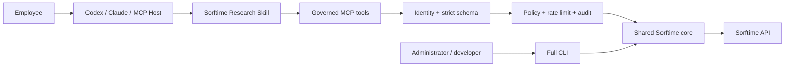

# Architecture

Sorftime MCP has one deterministic API core and three adapters. MCP and CLI do not call each other.

## Responsibilities

| Layer | Owns | Must not own |
|---|---|---|
| Shared core | Endpoint URL, auth header, timeout, response size, envelope errors | Team authorization or natural-language routing |
| MCP | Employee identity, explicit endpoint allowlist, strict inputs, audit, rate limits, billing circuit | Paid/mutating operations or arbitrary endpoint input |
| Skill | Intent routing, clarification, evidence-aware interpretation | Credentials, authorization, endpoint HTTP, CLI invocation |
| CLI | Full 52-endpoint operations, raw calls, batch/debug workflows | Ordinary employee MCP access policy |

## Initial public policy

`src/core/governance.ts` classifies every endpoint independently by billing, effect and exposure. The initial MCP surface registers only fixed routes whose endpoints are:

- `billing=free`;
- `effect=read`;
- `exposure=reader` or an explicitly enabled admin read.

Human-readable cost strings are never parsed for authorization. Unknown classifications fail closed.

## Request lifecycle

1. HTTP authenticates a per-user API key or validates trusted identity-gateway headers. Stdio binds one configured process identity.
2. MCP SDK validates a strict, bounded Zod schema.
3. The tool selects a hard-coded endpoint route; users never submit an endpoint name.
4. Governance validates endpoint billing/effect/exposure.
5. Per-identity and global rate limits run before the upstream call.
6. Audit writes a start event without complete argument values.
7. The shared core calls Sorftime with the server-held Account-SK.
8. The executor checks unexpected Request consumption, strips quota metadata from ordinary results, writes the finish event, and returns a unified result.

## Identity modes

- `api_key`: each Bearer key maps to stable `subject`, `tenant`, and `role` from server configuration.
- `trusted_headers`: a company gateway authenticates employees, injects identity headers, and proves itself with a separate proxy secret.
- `disabled`: loopback development only.
- stdio: one identity configured when the process starts; it is not employee SSO.

Sessions are bound to the authenticated identity. Reusing a session under another identity is rejected.

## Scaling boundaries

The initial rate limiter, billing circuit, and HTTP sessions are process-local. A multi-replica deployment needs shared rate/audit state and sticky routing or a distributed MCP session strategy. Do not describe one container as horizontally scalable without that work.
